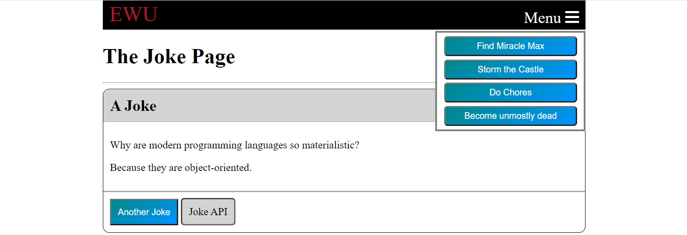

# EWU-CSCD371-2022-Winter

## See [Docs](Docs)

## Assignment 7+8
The purpose of this assignment is to write a simple HTML, CSS, and JavaScript page that uses events and styling to display jokes. Target modern browsers, no need for backwards compatibility.

## Reading
This isn't covered in the book. There are many HTML, CSS, and JavaScript tutorials and documentation sites on the web. Here are a few:

- https://developer.mozilla.org/en-US/docs/Web/HTML
- https://developer.mozilla.org/en-US/docs/Web/CSS
- https://developer.mozilla.org/en-US/docs/Web/JavaScript
- https://www.w3schools.com/
- https://web.dev/

Just like when working as a software developer, the web will be your primary sounce of information for this assignment.

## Instructions

### General
- The project should look like the image below ❌✔
- The project should have an index.html file ❌✔
  - With an index.js file in a js folder ❌✔
  - And a site.css file in a css folder (along with other css files) ❌✔
- There should be a `<head>`
  - With a favicon ❌✔
  - And a title ❌✔
- The `<body>` should use the middle 70% of the page ❌✔

### Menu Bar
- The page should have a title/menu bar ❌✔
  - Use Font Awesome for the hamburger icon (https://fontawesome.com/start) ❌✔ 
  - When clicked, the menu should appear under it ❌✔
  - The menu should have four buttons with creative names (the buttons don't need to do anything) ❌✔

### Create a card with `
`s and CSS
- Create a card from `
`s ❌✔
  - The card should have a header, body, and footer ❌✔
  - The CSS for this should be in the CSS file and work easily for another card. ❌✔

### Show jokes on the card
- Use the joke API from the first assignment to display a joke on a card (https://v2.jokeapi.dev/joke/Programming) ❌✔
  - Use Axios from the CDN for the API call. (https://cdn.jsdelivr.net/npm/axios/dist/axios.min.js)
  - If the joke API returns an error display a message to try again in a few moments ❌✔
  - The punch line should not show immediately, but appear after 4 seconds ❌✔
  - There should be a button to get another joke ❌✔
  - There should be `<a>` tag that links to the joke api documentation page ❌✔
    - This `<a>` should be manually styled as a button ❌✔
- Buttons should have a background that is a gradient ❌✔
- All buttons (even the `<a>` that you made into a button) should have a hover effect  ❌✔

## Extra Credit
Do the following:

1. Make the buttons in the menu do something creative ❌✔
2. Rather than just making the menu appear, have it fade in and slide down. ❌✔
3. Have the page jump to 100% width on a smaller screen and 50% on a larger screen with 70% on a regular screen.

## The page should look like this

## Fundamentals
- Ensure that:
  - This is built with raw HTML, CSS, and JavaScript, no external libraries aside from Axios and a font library ❌✔
  - The index.html file should work when opened from a file explorer ❌✔
  - Keep all files in appropriate folders ❌✔
  - Have warning free HTML, CSS, and JavaScript ❌✔
  - Use as little css as possible ❌✔
  - No inline CSS ❌✔
  - Validate HTML with: https://validator.w3.org/nu/#textarea (or similar) ❌✔
  - Validate CSS with: https://jigsaw.w3.org/css-validator/#validate_by_input (or similar) ❌✔
  - No errors when loading the page ❌✔
  - Choose simplicity over complexity ❌✔
